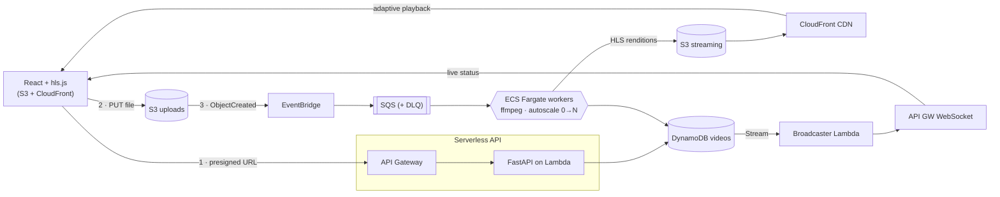

# RabbitHole 🐇

**An event-driven video-streaming platform on AWS.** Upload a video, a fleet of
autoscaling workers transcodes it into adaptive-bitrate HLS, and you stream it back
through a CDN — with live status updates the whole way.

Built as a portfolio piece to demonstrate **cloud architecture** (event-driven design,
serverless + container hybrid, infrastructure-as-code, autoscaling-to-zero, real-time,
observability, cost-awareness) and **fullstack** engineering end to end.

> **Status:** feature-complete (P0–P6). Runs locally against real AWS; one `terraform apply`
> from a live deployment. Not a toy CRUD app — the architecture is the point.

---

## Demo

> _`docs/demo.gif` — upload → `Transcoding` → `Ready` → adaptive playback. (Capture after deploy.)_

The 60-second story: **pick a video → it uploads straight to S3 → an event kicks off an
async transcode → the status flips to `Ready` in real time → click it and stream it back
with quality that adapts to your bandwidth.**

## Architecture



See **[docs/architecture.md](docs/architecture.md)** for the full decisions log.

## Why it's built this way

A streaming service is a textbook **asynchronous workload**: uploads are fast, transcoding
is slow and bursty. That mismatch is what event-driven, autoscaling infrastructure exists
to solve — which makes it a genuine demonstration of architectural judgment, not just CRUD.

| Decision | Rationale |
|---|---|
| **Lambda API + Fargate workers** | Right tool per job: serverless for the lightweight API, containers for long-running CPU-heavy ffmpeg. |
| **Direct-to-S3 upload** (presigned) | The API never proxies file bytes — cheap, fast, Lambda-friendly. |
| **EventBridge → SQS → workers** | Decoupled, resilient, fan-out-ready; DLQ + retries for failures. |
| **Autoscale on queue depth → 0** | Step scaling can scale *up from zero*; **no compute cost when idle**. |
| **No NAT Gateway** | Public subnets + zero-ingress SG → ~$0 idle (trade-off documented). |
| **CloudFront + OAC** | Adaptive HLS over a CDN; the S3 bucket stays fully private. |
| **DynamoDB Stream → WebSocket** | Real-time status without coupling the worker to the transport. |

## Cost-awareness

RabbitHole costs **~$0 when idle** — no running Fargate tasks, no NAT Gateway. It scales up
only when someone uploads, then back to zero. Each transcode's **Fargate cost is measured
and surfaced** in the UI (vCPU·s + GB·s at current rates).

## Stack
| Layer | Choice |
|---|---|
| Frontend | React + TypeScript (Vite), hls.js → S3 + CloudFront |
| API | FastAPI on Lambda (Mangum) + API Gateway |
| Workers | ECS Fargate + ffmpeg, step-autoscaling on SQS depth (min 0) |
| Real-time | DynamoDB Streams → Lambda → API Gateway WebSocket |
| Messaging | SQS + DLQ, EventBridge, S3 notifications |
| Data | S3 (uploads + streaming), DynamoDB |
| CDN | CloudFront (Origin Access Control) |
| IaC | Terraform |
| CI/CD | GitHub Actions |
| Observability | CloudWatch metrics/alarms, structured logs |

## Repo layout
```
frontend/   React app + hls.js player, cost dashboard, live status
api/        FastAPI service (presigned uploads, status) — runs on Lambda
worker/     ffmpeg transcode worker — runs on Fargate
lambdas/    WebSocket connect/disconnect + DynamoDB-stream broadcaster
infra/      Terraform — all AWS resources
scripts/    build + push the worker image to ECR
docs/        architecture decisions, diagram
```

## Run it

`make help` lists everything. Typical flow: `make install` → `make infra-apply` →
`make worker-push` → `make env` (fill from `make infra-output`) → `make api` + `make frontend`.
Run `make check` to validate the whole repo locally (no AWS needed). Full manual steps:

```bash
# 1. Provision AWS (needs credentials)
cd infra && terraform init && terraform apply

# 2. Build + push the worker image
../scripts/push-worker.sh

# 3. API — fill api/.env from `terraform output`
cd ../api && python -m venv .venv && source .venv/bin/activate
pip install -r requirements.txt && cp .env.example .env
uvicorn app.main:app --reload          # http://localhost:8000

# 4. Frontend — set VITE_API_URL + VITE_WS_URL from `terraform output`
cd ../frontend && npm install && cp .env.example .env
npm run dev                            # http://localhost:5173
```
Pick a video → watch it go `Transcoding → Ready` live → click to stream.

## Roadmap
- [x] **P0** — repo scaffold, Terraform skeleton, CI pipeline
- [x] **P1** — upload flow: presigned URL → browser → S3 (+ DynamoDB, status UI)
- [x] **P2** — S3 → EventBridge → SQS → Fargate worker → 720p + thumbnail
- [x] **P3** — multi-rendition HLS + CloudFront + hls.js adaptive player
- [x] **P4** — worker autoscaling on SQS depth with scale-to-zero
- [x] **P5** — real-time status (DynamoDB Stream → Lambda → WebSocket) + cost dashboard
- [x] **P6** — architecture diagram + case-study README

## What I'd change at scale
Honest production trade-offs (the demo deliberately optimizes for cost + clarity):
- **AWS Elemental MediaConvert** instead of self-managed ffmpeg — less ops, per-job billing.
- **Private subnets + VPC endpoints** for workers — defense-in-depth over the public-subnet demo.
- **GSI on `created_at`** instead of `Scan` for the library listing.
- **CloudFront + auth** in front of the API; **signed URLs / cookies** on the streaming bucket.
- **Code-split the frontend bundle** (hls.js is the bulk of it) and add per-user auth + quotas.
- **Multi-region** streaming origins with latency-based routing.
