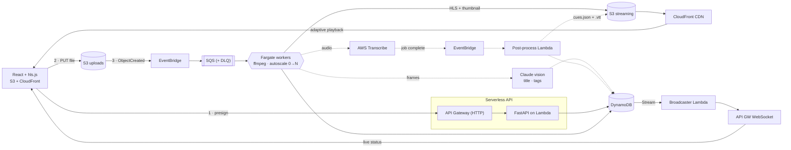

# RabbitHole 🐇

[](https://github.com/jetty-setter/rabbithole/actions/workflows/ci.yml)


**An event-driven, AI-augmented video platform on AWS.** Upload a video; a fleet of
autoscaling workers transcodes it to adaptive-bitrate HLS, a vision model writes its
title and tags, and speech-to-text makes every spoken word **searchable** — then you
stream it back through a CDN with live status the whole way.

Built as a portfolio piece to demonstrate **cloud architecture** (event-driven design,
serverless + container hybrid, infrastructure-as-code, autoscaling-to-zero, real-time,
cost-awareness), **AI integration** (vision + speech, two different invocation patterns),
and **fullstack** engineering end to end.

> **Live demo:** https://d2b8irgwcyn9l8.cloudfront.net
> **Status:** deployed on AWS, one `terraform apply` from reproducible. Not a toy CRUD
> app — the architecture is the point.

---

## What it does

- **Adaptive streaming** — every upload is transcoded into a 480/720/1080p HLS ladder with
  a master playlist; `hls.js` switches rendition to match bandwidth.
- **AI auto-metadata** — leave the title blank and Claude *vision* samples frames across the
  clip and writes a punchy, accuracy-guarded title, description, and tags.
- **Speech-to-text + in-video search** — AWS Transcribe turns audio into caption cues; the
  watch page gets a searchable transcript (click a line to jump) and real WebVTT captions.
- **Real-time status** — `Queued → Transcoding → Ready` updates live via WebSocket, no polling.
- **Engagement** — hop/thump reactions (anonymous voting), comments, favorites ("Stash").
- **Visibility** — publish **public** or **unlisted** (hidden from feeds, link still works),
  toggleable later by the owner.
- **Cost-aware** — ~$0 when idle; each transcode's Fargate cost is measured and surfaced.

## Architecture


```mermaid
flowchart LR
    UI["React + hls.js<br/>S3 + CloudFront"]

    subgraph API["Serverless API"]
      APIGW["API Gateway (HTTP)"] --> L["FastAPI on Lambda"]
    end

    UI -->|"1 · presign"| APIGW
    UI -->|"2 · PUT file"| UP[("S3 uploads")]
    UP -->|"3 · ObjectCreated"| EB["EventBridge"]
    EB --> Q[["SQS (+ DLQ)"]]
    Q --> W{{"Fargate workers<br/>ffmpeg · autoscale 0→N"}}
    W -->|"HLS + thumbnail"| ST[("S3 streaming")]
    ST --> CF["CloudFront CDN"]
    CF -->|"adaptive playback"| UI

    %% AI metadata (synchronous, Claude vision)
    W -.->|"frames"| AIV["Claude vision<br/>title · tags"]
    AIV -.-> DB

    %% Speech-to-text (async, event-driven)
    W -.->|"audio"| TR["AWS Transcribe"]
    TR -.->|"job complete"| TEB["EventBridge"]
    TEB -.-> TL["Post-process Lambda"]
    TL -.->|"cues.json + .vtt"| ST
    TL -.-> DB

    L --> DB[("DynamoDB")]
    W --> DB
    DB -->|"Stream"| BC["Broadcaster Lambda"]
    BC --> WS["API GW WebSocket"]
    WS -->|"live status"| UI
```

Solid arrows are the core upload→stream path; dotted arrows are the two AI pipelines.
Full decisions log, sequence diagrams, and data model: **[docs/architecture.md](docs/architecture.md)**.

## Why it's built this way

A streaming service is a textbook **asynchronous workload**: uploads are fast, transcoding
is slow and bursty. That mismatch is what event-driven, autoscaling infrastructure exists to
solve — which makes it a real demonstration of architectural judgment, not just CRUD.

| Decision | Rationale |
|---|---|
| **Lambda API + Fargate workers** | Right tool per job: serverless for the lightweight API, containers for long-running CPU-heavy ffmpeg. |
| **Direct-to-S3 upload** (presigned) | The API never proxies file bytes — cheap, fast, Lambda-friendly. |
| **EventBridge → SQS → workers** | Decoupled, resilient, fan-out-ready; DLQ + redelivery for failures (transcode is idempotent). |
| **Deterministic scale-to-zero** | A scale-up Lambda *pins* the autoscaling floor while work is queued; a scale-down Lambda releases it only when an idle alarm confirms the queue is empty. A stale metric can never strand a job — and idle cost is still **$0**. |
| **No NAT Gateway** | Public subnets + egress-only SG → ~$0 idle (trade-off documented). |
| **CloudFront + OAC** | Adaptive HLS over a CDN while the S3 bucket stays fully private. |
| **DynamoDB Stream → WebSocket** | Real-time status without coupling the worker to the transport. |
| **Claude vision for metadata** | Multi-frame sampling reads the *action*, not a static frame; key lives in SSM SecureString, never in code or state. |
| **AWS Transcribe over self-hosted Whisper** | Managed + event-driven (job-complete → EventBridge → Lambda); keeps the worker lean and gives native word-level timestamps. |
| **Unlisted enforced at the feed** | Filtering the list (not the link) is exactly "unlisted" semantics, and keeps `get_video` simple. |

## Stack

| Layer | Choice |
|---|---|
| Frontend | React + TypeScript (Vite), `hls.js` → S3 + CloudFront |
| API | FastAPI on Lambda (container image) + API Gateway (HTTP) |
| Workers | ECS Fargate + ffmpeg/ffprobe (ARM64/Graviton), autoscaling on SQS depth (min 0) |
| AI / ML | Claude vision (auto-metadata) · AWS Transcribe (captions + search) |
| Real-time | DynamoDB Streams → Lambda → API Gateway WebSocket |
| Messaging | SQS + DLQ, EventBridge (S3 + Transcribe events) |
| Data | S3 (uploads + streaming), DynamoDB |
| CDN | CloudFront (Origin Access Control, private origin) |
| Secrets | SSM Parameter Store (SecureString) |
| IaC | Terraform |
| Tests | pytest + moto (API + caption pipeline, 82% on tested sources), Vitest (frontend logic) |
| CI | GitHub Actions — tests + coverage gate, image build, `terraform validate` |

## Repo layout

```
frontend/   React app — hls.js player, transcript search, live status, cost chip
api/        FastAPI service (presigned uploads, videos, reactions, AI suggest) — Lambda
worker/     ffmpeg transcode + frame sampling + Transcribe kickoff — Fargate
lambdas/    websocket connect/disconnect · DynamoDB-stream broadcaster
            scaleup/scaledown (deterministic autoscaling) · transcribe (caption post-proc)
infra/      Terraform — every AWS resource
scripts/    build + push the worker image to ECR
docs/        architecture decisions + diagrams
```

## Run it locally

Needs AWS credentials (profile `rabbithole`) and Docker.

```bash
# 1 — Provision AWS
cd infra && terraform init && terraform apply

# 2 — Build + push the worker image, then force a deploy
../scripts/push-worker.sh

# 3 — API: fill api/.env from `terraform output`
cd ../api && python -m venv .venv && source .venv/bin/activate
pip install -r requirements.txt && cp .env.example .env
uvicorn app.main:app --reload          # http://localhost:8000

# 4 — Frontend: set VITE_API_URL + VITE_WS_URL from `terraform output`
cd ../frontend && npm install && cp .env.example .env
npm run dev                            # http://localhost:5173
```

### Tests

```bash
# Python — API (moto-faked AWS) + transcribe-lambda + worker logic, with coverage
pip install -r api/requirements-dev.txt
pytest --cov=app --cov=handler --cov-report=term-missing

# Frontend — pure logic (api helpers, caption cue selection)
cd frontend && npm test
```

CI runs both suites on every push/PR and fails under a 70% coverage floor on the
testable business logic. The transcode worker is ffmpeg/AWS orchestration, validated
end-to-end on deploy rather than unit-tested.

The AI features are optional and degrade gracefully: set the Anthropic key once as an SSM
SecureString (`/rabbithole-dev/anthropic-api-key`) to enable auto-metadata; the Transcribe
pipeline activates automatically once its IAM role is provisioned. Without either, uploads
still transcode and stream normally.

## Roadmap

- [x] **P0–P3** — scaffold, presigned upload, EventBridge→SQS→Fargate transcode, HLS + CloudFront + `hls.js`
- [x] **P4** — deterministic worker autoscaling with scale-to-zero
- [x] **P5** — real-time status (DynamoDB Stream → WebSocket) + per-video cost surfacing
- [x] **P6** — engagement: reactions, anonymous voting, comments, favorites
- [x] **P7** — AI auto-metadata (Claude vision, multi-frame, accuracy-guarded)
- [x] **P8** — speech-to-text pipeline + searchable transcript + WebVTT captions
- [x] **P9** — public/unlisted visibility; UI cohesion + responsive + loading skeletons
- [ ] **Next** — CI→CD (deploy on merge), test suite + coverage, CloudWatch dashboard + tracing, real multi-user auth, cross-video semantic search

## What I'd change at scale

Honest production trade-offs (the demo deliberately optimizes for cost + clarity):

- **AWS Elemental MediaConvert** instead of self-managed ffmpeg — less ops, per-job billing.
- **Private subnets + VPC endpoints** for workers — defense-in-depth over the public-subnet demo.
- **GSI on `created_at`** instead of `Scan` for the library listing + pagination.
- **Real auth** (Cognito / a user store) — today it's a single-creator model with an `owner` field.
- **Signed URLs / cookies** on the streaming bucket; **rate limiting** + scoped CORS on the API.
- **Code-split the frontend bundle** (`hls.js` is the bulk) and post Lighthouse numbers.
- **Multi-region** streaming origins with latency-based routing.
```
