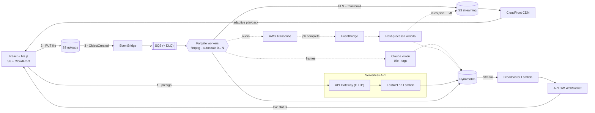

# RabbitHole 🐇

[](https://github.com/jetty-setter/rabbithole/actions/workflows/ci.yml)
[](https://github.com/jetty-setter/rabbithole/actions/workflows/deploy.yml)
[](https://github.com/jetty-setter/rabbithole/actions/workflows/terraform.yml)


**A curiosity-led video site for strange science, unexplained events, and the corners of
history people argue about, built on an event-driven, AI-augmented video platform on AWS.**

Editors collect videos, add a short reason to watch, and connect them with tags so a viewer
can follow one question into the next. Videos come in two ways: embedded from their original
creators with attribution, or hosted here when the license allows. Hosted videos run through
an asynchronous pipeline that transcodes them to adaptive-bitrate HLS, captions them with AWS
Transcribe, and makes every transcript searchable.

It is also a cloud-architecture project: event-driven design, a serverless plus container
hybrid, Infrastructure as Code, deterministic scale-to-zero, live status over WebSockets,
and cost-aware operations, with AI features that are optional and degrade gracefully.

## Engineering evidence

- **Event-driven processing:** [`infra/events.tf`](infra/events.tf) routes S3 object-created
  events through EventBridge to SQS; [`infra/messaging.tf`](infra/messaging.tf) adds the
  job queue and dead-letter queue.
- **Container compute:** [`infra/ecs.tf`](infra/ecs.tf) defines the ARM64 ECS Fargate
  worker, and [`worker/`](worker/) contains the ffmpeg processing implementation.
- **Deterministic scale-to-zero:** [`infra/autoscaling.tf`](infra/autoscaling.tf),
  [`infra/scaleup.tf`](infra/scaleup.tf), and [`infra/scaledown.tf`](infra/scaledown.tf)
  coordinate queue-aware wake-up and safe return to zero only after queued and in-flight
  work is gone.
- **OIDC-based delivery:** [`.github/workflows/deploy.yml`](.github/workflows/deploy.yml)
  and [`.github/workflows/terraform.yml`](.github/workflows/terraform.yml) assume AWS
  roles through GitHub OIDC rather than storing long-lived AWS deployment credentials.
- **Operational visibility:** [`infra/observability.tf`](infra/observability.tf) defines
  CloudWatch views for queue health, worker utilization, API latency/errors, and custom
  transcode cost metrics.

---

## What it does

**Discovery**
- **Homepage, Tunnels, Map, Trail:** the homepage leads with real videos. Tunnels browse by
  topic tag. The Map is a graph of connected cases you can step through. Trail is your local
  watch history, and Tumble jumps to something random.
- **Related rail:** curated threads (with a one-line reason for each connection) come first,
  followed by tag-based matches.
- **RabbitHole articles:** long-form write-ups with sources. A background evidence pipeline
  snapshots each cited source so readers can search the evidence.

**Getting videos in**
- **Embedded finds:** an editor adds a YouTube link with a title, a reason to watch, and tags.
  The original creator keeps hosting it; RabbitHole embeds the official player and credits them.
- **Hosted uploads:** public-domain and openly licensed videos go through the upload pipeline
  (see `scripts/upload-hosted-finds.py`). Audio-only sources are wrapped in a title card first.

**Search and transcripts**
- **Speech-to-text:** AWS Transcribe turns hosted audio into caption cues, giving the watch
  page a searchable, click-to-seek transcript and real WebVTT captions. Embedded videos get
  transcripts from imported caption exports (`scripts/import-caption-exports.py`).
- **Cross-video semantic search:** a local embedding model (bge-small / ONNX, baked into the
  API) indexes every transcript. Searching a phrase ranks the best moment in each video across
  the library by meaning and deep-links the player to that timestamp.

**Platform**
- **Adaptive streaming:** every hosted upload is transcoded into a 480/720/1080p HLS ladder
  with a master playlist; `hls.js` switches rendition to match bandwidth.
- **Optional AI metadata:** Claude vision samples frames and suggests a title, description and
  tags, but only when the uploader asks for it.
- **Real-time status:** `Queued, Transcoding, Ready` updates live via WebSocket, no polling.
- **Engagement and visibility:** hop/thump reactions, comments, favorites, and public or
  unlisted publishing.
- **Cost-aware:** about $0 when idle, and each transcode's Fargate cost is measured and shown.

## Architecture


```mermaid
flowchart LR
    UI["React + hls.js<br/>S3 + CloudFront"]

    subgraph API["Serverless API"]
      APIGW["API Gateway (HTTP)"] --> L["FastAPI on Lambda"]
    end

    UI -->|"1 · presign"| APIGW
    UI -->|"2 · PUT file"| UP[("S3 uploads")]
    UP -->|"3 · ObjectCreated"| EB["EventBridge"]
    EB --> Q[["SQS (+ DLQ)"]]
    Q --> W{{"Fargate workers<br/>ffmpeg · autoscale 0→N"}}
    W -->|"HLS + thumbnail"| ST[("S3 streaming")]
    ST --> CF["CloudFront CDN"]
    CF -->|"adaptive playback"| UI

    %% AI metadata (synchronous, Claude vision)
    W -.->|"frames"| AIV["Claude vision<br/>title · tags"]
    AIV -.-> DB

    %% Speech-to-text (async, event-driven)
    W -.->|"audio"| TR["AWS Transcribe"]
    TR -.->|"job complete"| TEB["EventBridge"]
    TEB -.-> TL["Post-process Lambda"]
    TL -.->|"cues.json + .vtt"| ST
    TL -.-> DB

    L --> DB[("DynamoDB")]
    W --> DB
    DB -->|"Stream"| BC["Broadcaster Lambda"]
    BC --> WS["API GW WebSocket"]
    WS -->|"live status"| UI
```

Solid arrows are the core upload→stream path; dotted arrows are the two AI pipelines.
Full decisions log, sequence diagrams, and data model: **[docs/architecture.md](docs/architecture.md)**.

## Why it's built this way

A streaming service is a textbook **asynchronous workload**: uploads are fast, transcoding
is slow and bursty. That mismatch is what event-driven, autoscaling infrastructure exists to
solve — which makes it a real demonstration of architectural judgment, not just CRUD.

| Decision | Rationale |
|---|---|
| **Lambda API + Fargate workers** | Right tool per job: serverless for the lightweight API, containers for long-running CPU-heavy ffmpeg. |
| **Direct-to-S3 upload** (presigned) | The API never proxies file bytes — cheap, fast, Lambda-friendly. |
| **EventBridge → SQS → workers** | Decoupled, resilient, fan-out-ready; DLQ + redelivery for failures (transcode is idempotent). |
| **Deterministic scale-to-zero** | A scale-up Lambda *pins* the autoscaling floor while work is queued; a scale-down Lambda releases it only when an idle alarm confirms the queue is empty. A stale metric can never strand a job — and idle cost is still **$0**. |
| **No NAT Gateway** | Public subnets + egress-only SG → ~$0 idle (trade-off documented). |
| **CloudFront + OAC** | Adaptive HLS over a CDN while the S3 bucket stays fully private. |
| **DynamoDB Stream → WebSocket** | Real-time status without coupling the worker to the transport. |
| **Claude vision for metadata** | Multi-frame sampling reads the *action*, not a static frame; key lives in SSM SecureString, never in code or state. |
| **AWS Transcribe over self-hosted Whisper** | Managed + event-driven (job-complete → EventBridge → Lambda); keeps the worker lean and gives native word-level timestamps. |
| **Unlisted enforced at the feed** | Filtering the list (not the link) is exactly "unlisted" semantics, and keeps `get_video` simple. |

## Stack

| Layer | Choice |
|---|---|
| Frontend | React + TypeScript (Vite), `hls.js` → S3 + CloudFront |
| API | FastAPI on Lambda (container image) + API Gateway (HTTP) |
| Workers | ECS Fargate + ffmpeg/ffprobe (ARM64/Graviton), autoscaling on SQS depth (min 0) |
| AI / ML | Claude vision (auto-metadata) · AWS Transcribe (captions) · local embeddings (bge-small/ONNX) for cross-video semantic search |
| Real-time | DynamoDB Streams → Lambda → API Gateway WebSocket |
| Messaging | SQS + DLQ, EventBridge (S3 + Transcribe events) |
| Data | S3 (uploads + streaming), DynamoDB |
| CDN | CloudFront (Origin Access Control, private origin) |
| Secrets | SSM Parameter Store (SecureString) |
| IaC | Terraform |
| Tests | pytest + moto (API + caption pipeline, 82% on tested sources), Vitest (frontend logic) |
| CI | GitHub Actions — tests + coverage gate, image build, `terraform validate` |
| CD | GitHub Actions on merge → OIDC role (no static keys) → build/push images, roll out Lambda + Fargate, publish frontend + invalidate CDN |
| Observability | CloudWatch dashboard (pipeline + worker + API + **$/day** via a custom worker metric); X-Ray tracing on the serverless path |

## Repo layout

```
frontend/   React app: homepage, tunnels, map, trail, watch page, hls.js player,
            transcript search, RabbitHole article reader, admin
api/        FastAPI service, deployed as a Lambda container image
  app/main.py        app wiring only: CORS, router registration, Lambda handler
  app/routers/       one module per feature: system (auth), videos, uploads and
                     external ingest, engagement, comments, topics, discovery (search),
                     curation (thumbnails, featured), ai
  app/helpers.py     pure helpers (tags, visibility, filenames)
  app/serializers.py DynamoDB items to response models
  app/rabbithole_*   RabbitHole article model, routes, storage, validation
worker/     ffmpeg transcode, smart thumbnails, Transcribe kickoff (Fargate)
lambdas/    websocket connect/disconnect, DynamoDB-stream broadcaster,
            scaleup/scaledown (deterministic autoscaling), transcribe (caption
            post-processing), evidence (source snapshots for articles)
infra/      Terraform for every AWS resource
scripts/    seed and curation tools (dry run by default): seed-curiosity,
            upload-hosted-finds, import-caption-exports, backfills, push-worker.sh
docs/       architecture decisions, content model, evidence pipeline, video curation
```

## Run it locally

Needs AWS credentials (profile `rabbithole`) and Docker.

```bash
# 1 — Provision AWS
cd infra && terraform init && terraform apply

# 2 — Build + push the worker image, then force a deploy
../scripts/push-worker.sh

# 3 — API: fill api/.env from `terraform output`
cd ../api && python -m venv .venv && source .venv/bin/activate
pip install -r requirements.txt && cp .env.example .env
uvicorn app.main:app --reload          # http://localhost:8000

# 4 — Frontend: set VITE_API_URL + VITE_WS_URL from `terraform output`
cd ../frontend && npm install && cp .env.example .env
npm run dev                            # http://localhost:5173
```

### Tests

```bash
# Python — API (moto-faked AWS) + transcribe-lambda + worker logic, with coverage
pip install -r api/requirements-dev.txt
pytest --cov=app --cov=handler --cov-report=term-missing

# Frontend — pure logic (api helpers, caption cue selection)
cd frontend && npm test
```

CI runs both suites on every push/PR and fails under a 70% coverage floor on the
testable business logic. The transcode worker is ffmpeg/AWS orchestration, validated
end-to-end on deploy rather than unit-tested.

### Deployment

Everything runs through GitHub Actions via **OIDC-assumed roles** — no static AWS keys.

- **App** — a push to `main` triggers the **Deploy** workflow: build/push the API +
  worker images, roll out the Lambda and Fargate service, publish the frontend + invalidate the CDN.
- **Infra** — Terraform state lives in a **versioned, encrypted S3 bucket with native
  state locking**. The **Terraform** workflow auto-runs `plan` on a merge that touches
  `infra/` (visibility) and runs `apply` via a **manual dispatch** — auto-applying infra
  on every merge is deliberately avoided (blast radius). Each role's OIDC trust is scoped
  to this repo's `main` branch, so fork PRs can't assume them.

### Observability

A CloudWatch **dashboard** (`rabbithole-dev-ops`) makes the pipeline legible at a glance:
queue depth + oldest-message age + DLQ, worker CPU/memory, API invocations/errors/**p95**/throttles,
and a **FinOps** row — transcodes, **$ spent**, and average transcode time — driven by a custom
metric the worker emits per job (`RabbitHole/Transcode`). **X-Ray** active tracing on the API and
transcription Lambdas gives request traces + a service map across their AWS calls. (Worker-level
tracing would add a Fargate X-Ray sidecar — a noted follow-up.)

The AI features are optional and degrade gracefully: set the Anthropic key once as an SSM
SecureString (`/rabbithole-dev/anthropic-api-key`) to enable auto-metadata; the Transcribe
pipeline activates automatically once its IAM role is provisioned. Without either, uploads
still transcode and stream normally.

## Implemented milestones — video-platform iteration (earlier work)

- [x] **P0–P3** — scaffold, presigned upload, EventBridge→SQS→Fargate transcode, HLS + CloudFront + `hls.js`
- [x] **P4** — deterministic worker autoscaling with scale-to-zero
- [x] **P5** — real-time status (DynamoDB Stream → WebSocket) + per-video cost surfacing
- [x] **P6** — engagement: reactions, anonymous voting, comments, favorites
- [x] **P7** — AI auto-metadata (Claude vision, multi-frame, accuracy-guarded)
- [x] **P8** — speech-to-text pipeline + searchable transcript + WebVTT captions
- [x] **P9** — public/unlisted visibility; UI cohesion + responsive + loading skeletons
- [x] **P10** — test suite + coverage-gated CI; security hardening (scoped CORS, rate limiting, reserved admin)
- [x] **P11** — OIDC-based CD: build/push images, roll out Lambda + Fargate, publish frontend on merge
- [x] **P12** — remote Terraform state (S3 + native locking) + infra-through-CI (plan on merge, gated apply)
- [x] **P13** — observability: CloudWatch dashboard (pipeline, worker, API, **$/day**) + X-Ray tracing on the serverless path
- [x] **P14** — cross-video semantic search: local embedding model + brute-force vector search + jump-to-moment deep links
- [ ] **Deferred in this iteration** — real multi-user auth; worker-level (Fargate) X-Ray sidecar

## Implemented milestones — curiosity-platform iteration

- [x] **Curated discovery** — homepage built on real videos, topic Tunnels, the case Map, local Trail, and curated threads in the related rail
- [x] **Embedded finds** — official YouTube players with creator attribution, added by editors with a reason to watch and connecting tags
- [x] **RabbitHole articles** — long-form model with sources, plus an asynchronous evidence pipeline (stream, SQS, worker, S3 snapshots) and "Search the evidence"
- [x] **Transcript passage search** — timestamped passages deep-link into the player
- [x] **Hosted public-domain finds** — manifest-driven script that runs licensed videos through the full transcode and Transcribe pipeline
- [x] **API split by feature** — `main.py` reduced to wiring; routes live in `app/routers/` with an identical route table and OpenAPI document

## What I'd change at scale

Honest production trade-offs (the demo deliberately optimizes for cost + clarity):

- **AWS Elemental MediaConvert** instead of self-managed ffmpeg — less ops, per-job billing.
- **Private subnets + VPC endpoints** for workers — defense-in-depth over the public-subnet demo.
- **GSI on `created_at`** instead of `Scan` for the library listing + pagination.
- **Real auth** (Cognito / a user store) — today it's a single-creator model with an `owner` field.
- **Signed URLs / cookies** on the streaming bucket; **rate limiting** + scoped CORS on the API.
- **Code-split the frontend bundle** (`hls.js` is the bulk) and post Lighthouse numbers.
- **Multi-region** streaming origins with latency-based routing.
```
