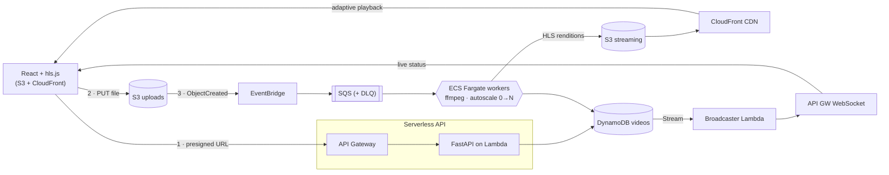

# Architecture & Decisions

This document is the "case study" companion to the project — the *why* behind the build.

## Problem framing
A video-streaming service is a textbook **asynchronous workload**: uploading is fast, but
transcoding a video into multiple streamable renditions is slow and bursty. That mismatch is
exactly what an event-driven, autoscaling architecture is for — and what makes this a useful
demonstration of cloud-architecture judgment.

## Request lifecycle
1. **Upload** — the browser asks the API for a presigned S3 URL and uploads the raw file
   directly to S3 (the API never proxies file bytes — keeps Lambda cheap and fast).
2. **Trigger** — `s3:ObjectCreated` fires an EventBridge rule that enqueues a transcode job
   in SQS. A metadata record is created in DynamoDB with status `uploaded`.
3. **Process** — Fargate workers long-poll SQS, run ffmpeg to produce HLS renditions
   (480/720/1080p) + a thumbnail, and write outputs to the streaming bucket.
4. **Serve** — CloudFront fronts the streaming bucket; the React player (hls.js) streams the
   HLS manifest and switches rendition based on bandwidth.

## Why these choices
| Decision | Rationale | Trade-off acknowledged |
|---|---|---|
| Lambda for API | Spiky, lightweight; scale-to-zero | Cold starts → mitigated w/ provisioned concurrency if needed |
| Fargate for workers | Long-running, CPU-heavy ffmpeg; no Lambda 15-min limit | More ops than Lambda; justified by workload shape |
| SQS + DLQ | Decouples upload from processing; resilient to worker failure | At-least-once delivery → workers must be idempotent |
| Autoscale on queue depth | Matches capacity to backlog, controls cost | Scale-up latency → acceptable for async UX |
| Custom ffmpeg vs MediaConvert | Demonstrates the pattern; full control | MediaConvert likely cheaper/simpler in prod |

## Networking & the NAT trade-off
Fargate workers run in **public subnets** with a **zero-ingress security group** and
**no NAT Gateway**. Rationale:
- The worker accepts **no inbound traffic** — it only makes outbound calls (SQS, S3,
  DynamoDB). With no ingress rules, the practical attack surface is minimal.
- A NAT Gateway is ~$32/month flat; this design costs ~$0 when idle.

This is a deliberate cost choice for a demo, **not** the textbook posture. In production
I'd move workers to **private subnets** and give them egress via **VPC endpoints**
(gateway endpoints for S3/DynamoDB are free; interface endpoints for ECR/SQS/Logs cost
roughly the same as a NAT Gateway at this scale — so the choice is about defense-in-depth,
not cost). The consensus best practice is "private subnets," and NAT vs. VPC endpoints is
the implementation detail.

## Autoscaling & scale-to-zero
The worker fleet scales on **SQS queue depth** via Application Auto Scaling:
- A CloudWatch alarm on `ApproximateNumberOfMessagesVisible >= 1` triggers a **scale-out**
  step policy; a 5-minute "queue drained" alarm triggers **scale-in to zero**.
- **Step scaling** (not target tracking) is deliberate — it can scale **up from zero**,
  which target tracking's "backlog per task" ratio can't do with no running tasks.
- `min_capacity = 0` means **no Fargate cost when idle** — the single biggest cost lever
  in the system. Combined with no NAT Gateway, RabbitHole costs ~$0 when nobody's uploading.
- Terraform sets the service's initial `desired_count` then `ignore_changes` hands control
  to the autoscaler, so IaC and runtime scaling don't fight.

## Real-time status
Status changes are pushed to the browser instead of polled:
`DynamoDB Stream (videos) → broadcaster Lambda → API Gateway WebSocket → client`.
- The worker just writes status to DynamoDB — it has **no knowledge** of WebSockets.
  The stream decouples the producer from the push, so the pipeline stays clean.
- A `$connect`/`$disconnect` Lambda tracks live connection IDs in their own table;
  the broadcaster fans out changes and prunes stale connections (`GoneException`).
- The frontend falls back to slow polling if the WebSocket is unavailable.

## Observability
- CloudWatch dashboard: queue depth, worker count, transcode duration, error rate.
- Alarms on DLQ depth and transcode failure rate.
- X-Ray traces across API → SQS → worker.

## Cost-awareness (the flourish)
Each video records its processing cost (worker seconds × Fargate rate + storage + egress
estimate), surfaced in a small dashboard — demonstrating cost as a first-class architectural
concern.

## Diagram

