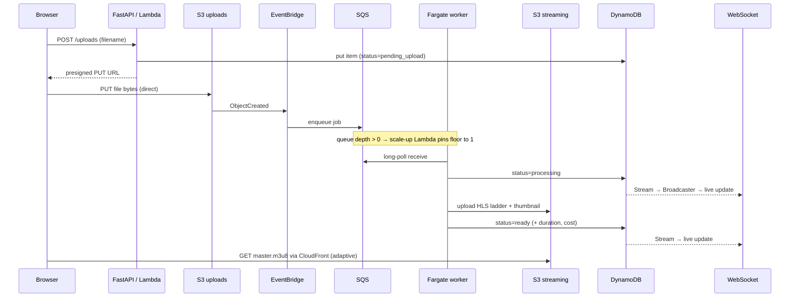
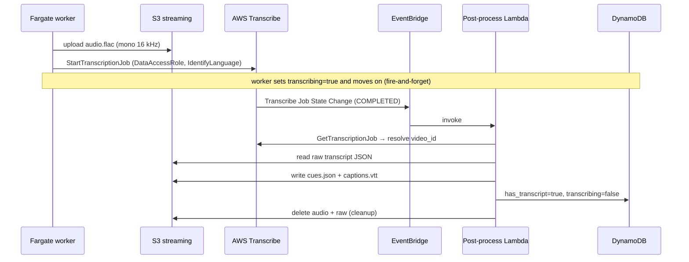

# RabbitHole — Architecture

This is the decisions log behind RabbitHole: the flows, the data model, and the
**why** for each non-obvious choice. The high-level picture lives in the
[README](../README.md); this document goes a layer deeper.

## Contents
- [System overview](#system-overview)
- [Key flows](#key-flows)
- [Data model](#data-model)
- [Autoscaling: deterministic scale-to-zero](#autoscaling-deterministic-scale-to-zero)
- [Security posture](#security-posture)
- [Cost model](#cost-model)
- [Resilience & failure handling](#resilience--failure-handling)
- [Architecture Decision Records](#architecture-decision-records)
- [Known trade-offs](#known-trade-offs)

---

## System overview

RabbitHole is a **serverless + container hybrid**. The control plane (API, real-time,
post-processing) is serverless and scales to zero; the data plane (video transcode) runs on
containers because it is long-running and CPU-bound. Everything in between is decoupled by
events and queues so each part fails and scales independently.

| Plane | Components | Why |
|---|---|---|
| **Edge / client** | React SPA on S3, fronted by CloudFront; `hls.js` player | Static hosting, global cache, adaptive playback |
| **Control plane** | API Gateway → FastAPI on Lambda; WebSocket API; post-processing Lambdas | Lightweight, spiky, scale-to-zero |
| **Data plane** | ECS Fargate workers (ffmpeg) | Long-running, CPU-heavy, needs full OS/binaries |
| **Backbone** | S3, DynamoDB (+ Streams), SQS (+ DLQ), EventBridge, SSM, CloudFront | Managed, decoupled, pay-per-use |

---

## Key flows

### 1 · Upload → transcode → ready (with live status)

```mermaid
sequenceDiagram
    participant B as Browser
    participant API as FastAPI / Lambda
    participant S3u as S3 uploads
    participant EB as EventBridge
    participant SQS as SQS
    participant W as Fargate worker
    participant S3s as S3 streaming
    participant DB as DynamoDB
    participant WS as WebSocket

    B->>API: POST /uploads (filename)
    API->>DB: put item (status=pending_upload)
    API-->>B: presigned PUT URL
    B->>S3u: PUT file bytes (direct)
    S3u->>EB: ObjectCreated
    EB->>SQS: enqueue job
    Note over SQS,W: queue depth > 0 → scale-up Lambda pins floor to 1
    W->>SQS: long-poll receive
    W->>DB: status=processing
    DB-->>WS: Stream → Broadcaster → live update
    W->>S3s: upload HLS ladder + thumbnail
    W->>DB: status=ready (+ duration, cost)
    DB-->>WS: Stream → live update
    B->>S3s: GET master.m3u8 via CloudFront (adaptive)
```

### 2 · Speech-to-text → searchable captions (event-driven)

```mermaid
sequenceDiagram
    participant W as Fargate worker
    participant S3s as S3 streaming
    participant TR as AWS Transcribe
    participant EB as EventBridge
    participant L as Post-process Lambda
    participant DB as DynamoDB

    W->>S3s: upload audio.flac (mono 16 kHz)
    W->>TR: StartTranscriptionJob (DataAccessRole, IdentifyLanguage)
    Note over W,DB: worker sets transcribing=true and moves on (fire-and-forget)
    TR->>EB: Transcribe Job State Change (COMPLETED)
    EB->>L: invoke
    L->>TR: GetTranscriptionJob → resolve video_id
    L->>S3s: read raw transcript JSON
    L->>S3s: write cues.json + captions.vtt
    L->>DB: has_transcript=true, transcribing=false
    L->>S3s: delete audio + raw (cleanup)
```

The worker never blocks on transcription — it kicks off the job and returns, so transcode
latency is unaffected. The Lambda parses word-level items into readable cues (break on
sentence end, long pause, or ~42 chars) and writes both a machine-readable `cues.json`
(the searchable transcript) and a `captions.vtt` track for the `<video>` element.

---

## Data model

Single DynamoDB table, partition key `video_id`. Representative item:

| Attribute | Example | Notes |
|---|---|---|
| `video_id` | `707a37ec…` (uuid4 hex) | PK |
| `status` | `ready` | `pending_upload → processing → ready` \| `failed` |
| `owner` | `jettysetter` | null for seed/demo content |
| `visibility` | `public` \| `unlisted` | missing ⇒ treated as `public` |
| `title` / `description` / `tags` | … | user- or AI-supplied |
| `ai_generated` | `true` | metadata came from Claude vision |
| `hls_key` / `thumb_key` | `…/hls/master.m3u8` | keys, rendered to CDN URLs by the API |
| `has_transcript` / `transcribing` | `true` / `false` | drives the transcript UI |
| `transcript_key` / `vtt_key` | `…/cues.json` | written by the post-process Lambda |
| `duration_seconds` / `cost_usd` | `12.4` / `0.0007` | measured at transcode time |
| `views` / `hops` / `thumps` | counters | atomic `ADD` updates |

Listing uses a bounded `Scan` (fine at portfolio scale; a GSI on `created_at` is the
production move). The API maps stored keys to CloudFront URLs at read time, so the bucket
layout can change without breaking clients.

---

## Autoscaling: deterministic scale-to-zero

The interesting part, and the one that bit me first. Naive "step scaling on queue depth"
has a race: a freshly-enqueued job can be reaped by an idle/lagging metric before a worker
ever picks it up, leaving uploads stuck at `Queued`.

The fix makes scale-to-zero **deterministic** by separating "scale up" from "release to zero":

- **Scale-up Lambda** (on the queue-not-empty alarm): registers the autoscaling target with
  `MinCapacity = 1`, *pinning* a worker on as long as work exists.
- **Scale-down Lambda** (on the idle alarm entering `ALARM` — visible + in-flight messages
  `< 1` for 5 minutes): releases `MinCapacity` back to `0` and sets desired count to `0`.

Because the floor is only released when an alarm *confirms* the queue is empty — never while
a job is queued or in flight — a stale metric can't strand an upload, yet idle cost is still
zero. Terraform `ignore_changes = [min_capacity]` keeps the Lambdas, not Terraform, in
charge of the live floor.

---

## Security posture

- **Private streaming origin** — the streaming S3 bucket is locked to CloudFront via Origin
  Access Control; objects are not publicly readable.
- **Least-privilege IAM** — every role is scoped to its job: the worker can read uploads /
  write streaming / consume the queue / start a Transcribe job (and `PassRole` only the
  Transcribe data-access role, conditioned on `iam:PassedToService`); the post-process
  Lambda can only touch the streaming prefix + `UpdateItem`.
- **Secrets out of band** — the Anthropic API key is an SSM SecureString, read at runtime
  via `functools.lru_cache`; it never appears in code, env files, or Terraform state.
- **Egress-only workers** — the worker security group allows no inbound traffic.
- **Honest gaps (demo-stage):** single-creator JWT auth with a default credential, `CORS *`,
  no rate limiting. See [Known trade-offs](#known-trade-offs).

---

## Cost model

- **~$0 at idle** — no running Fargate tasks, no NAT Gateway, serverless everywhere else.
- **Per-transcode cost is measured**: the worker times the transcode and computes Fargate
  cost from vCPU·s + GB·s at current rates, storing `cost_usd` on the item and surfacing it
  in the UI.
- **ARM64/Graviton** workers — ~20% cheaper than x86 and matches local Apple-silicon builds.
- **CloudFront PriceClass_100** (NA + EU edges) — cheapest tier for a demo.

---

## Resilience & failure handling

- **At-least-once + idempotent** — SQS redelivers un-deleted messages; the transcode is
  idempotent (re-running overwrites the same keys), so retries are safe. Poison messages
  land in the **DLQ** after `maxReceiveCount`.
- **No phantom records** — every worker/Lambda write is guarded by
  `attribute_exists(video_id)`, so a job for a deleted video can't resurrect it.
- **Graceful AI degradation** — no Anthropic key ⇒ auto-metadata is dormant; no audio /
  no speech ⇒ transcription is skipped and the video still plays. AI never blocks the
  core pipeline.

---

## Architecture Decision Records

Concise ADRs — context, decision, consequences.

### ADR-1 — Lambda API + Fargate workers (hybrid, not one or the other)
**Context:** the API is lightweight and spiky; transcoding is long-running and CPU-bound
(Lambda's 15-min / no-real-ffmpeg-OS constraints don't fit). **Decision:** FastAPI on Lambda
for the control plane, ECS Fargate for the data plane. **Consequences:** best tool per job and
independent scaling, at the cost of two runtimes to build/deploy.

### ADR-2 — Direct-to-S3 presigned uploads
**Context:** routing file bytes through the API would be slow and blow Lambda limits.
**Decision:** the API returns a presigned `PUT`; the browser uploads straight to S3.
**Consequences:** the API stays tiny and stateless; S3 `ObjectCreated` becomes the pipeline's
trigger.

### ADR-3 — EventBridge → SQS → workers
**Context:** transcoding must survive bursts and worker failures. **Decision:** S3 events fan
into EventBridge, then a buffered SQS queue (with DLQ) that workers long-poll.
**Consequences:** producers and consumers are fully decoupled and fan-out-ready; adds a queue
to operate.

### ADR-4 — Deterministic scale-to-zero
**Context:** plain queue-depth step scaling raced and stranded jobs. **Decision:** pin the
autoscaling floor while work is queued (scale-up Lambda) and release it only on a confirmed
idle alarm (scale-down Lambda). **Consequences:** uploads can't be stranded by a stale metric,
idle cost stays $0; two small Lambdas + an alarm to maintain. *(See section above.)*

### ADR-5 — No NAT Gateway
**Context:** a NAT Gateway is ~$32/mo of idle cost — most of the bill for a demo.
**Decision:** run workers in public subnets with an **egress-only** security group.
**Consequences:** ~$0 idle networking; the production hardening is private subnets + VPC
endpoints (documented, not done).

### ADR-6 — CloudFront + Origin Access Control
**Context:** want a global, cacheable HLS origin without a public bucket. **Decision:**
CloudFront with OAC; the bucket policy allows only the distribution. **Consequences:** private
origin + CDN performance; cache invalidation is part of the deploy.

### ADR-7 — DynamoDB Streams → WebSocket for real-time
**Context:** clients need live `Queued→Ready` updates without polling. **Decision:** a Stream
on the table drives a Broadcaster Lambda that pushes over an API Gateway WebSocket.
**Consequences:** the worker stays ignorant of the transport (it just updates the row);
real-time is a side effect of the data changing.

### ADR-8 — AI auto-metadata via Claude vision (multi-frame)
**Context:** untitled uploads need good titles; a single thumbnail misses the payoff.
**Decision:** sample frames across the clip and prompt Claude vision for a punchy,
accuracy-guarded title/description/tags; key in SSM. **Consequences:** titles read the
*action*, not a static frame; the same prompt runs at upload time (browser-extracted frames)
and in the worker, kept in sync.

### ADR-9 — AWS Transcribe over self-hosted Whisper
**Context:** captions + search need transcription with timestamps. **Decision:** managed AWS
Transcribe, kicked off by the worker and completed asynchronously (job-complete →
EventBridge → Lambda). **Consequences:** the worker stays lean and transcode latency is
unaffected; native word-level timestamps; trade is per-minute cost and an extra event hop vs.
running a model in-container.

### ADR-10 — "Unlisted" enforced at the feed, not the link
**Context:** owners want to share drafts without publishing them. **Decision:** unlisted
videos are filtered from feeds/search server-side (optional-auth so owners still see their
own); the direct link stays open. **Consequences:** exactly "unlisted" semantics with a
trivial `get_video`; truly-private (block the link) is a small follow-up if needed.

---

## Known trade-offs

The demo optimizes for cost and clarity. For production I'd change:

- **Auth** — Cognito or a real user store; today it's a single-creator JWT with an `owner`
  field and a default credential that must be rotated before public sharing.
- **API edge** — scoped CORS, rate limiting, and CloudFront/WAF in front of the API.
- **Data** — GSI on `created_at` + pagination instead of `Scan`.
- **Networking** — private subnets + VPC endpoints for the workers.
- **Transcode** — AWS Elemental MediaConvert to shed ffmpeg ops.
- **Frontend** — code-split the bundle (`hls.js` dominates) and publish Lighthouse scores.
- **Delivery** — CD on merge, a test suite with coverage, and a CloudWatch dashboard + X-Ray
  tracing across the pipeline.
